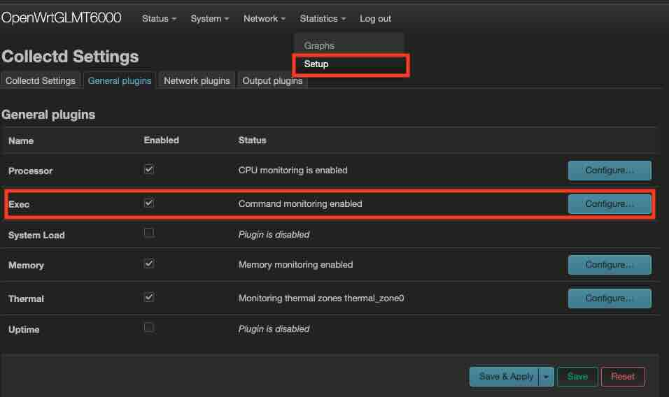
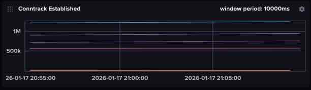
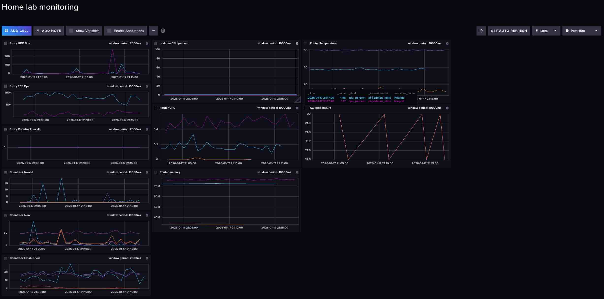
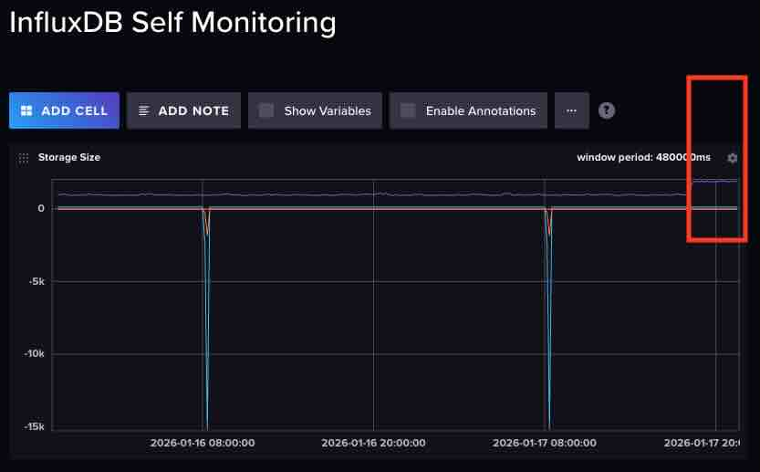

# Annoying Random Network Issue

After "bruteforcely" rebooted my router last week, the random network issue seems to happen less frequently, but isn't fully going away. Every few hours, I feel the network may jitter a bit. It is especially obvious when I am in video streaming or in an online meeting. I suspecting it is something with the ISP, but I don't have any clues.

# Try log something

Since I already have a semi-working monitoring on my router and connected it with a local hosted influxdb. I decided to at least log something from the router's network stack. Maybe I am able to inspect some changes in data the next time the "jitter" happens.

I only know a little bit about the network stack. After some Q&A with Gemini, I think the most simple, however, maybe useful thing to log is the `conntrack` states. It tells things of how many TCP connections my home devices are trying to open, how many connections are successfully established and running, and how many are seriously wrong, which are denoted by `new`, `established`, and `invalid` state value. These three states also exist in UDP, however, mean slightly different things. I am not yet sure about how to use `conntrack` stte to tell an ISP issue, or a router issue, or something else, though I assume tracking their trends is helpful. 

I am going to add `2 (TCP / UDP) * 3 (Input / Output / Forward) * 3 (New / Established / Invalid) = 18` counters into the network stack using netfilters. I don't have IPv6 setup, so only IPv4 parts are concerned.

The netfilter rule are
```
table ip conntrack_stats
flush table ip conntrack_stats

table ip conntrack_stats {
  # Conntrack counters
  counter tcp_conntrack_fwd_new {}
  counter tcp_conntrack_fwd_established {}
  counter tcp_conntrack_fwd_invalid {}

  counter tcp_conntrack_input_new {}
  counter tcp_conntrack_input_established {}
  counter tcp_conntrack_input_invalid {}

  counter tcp_conntrack_output_new {}
  counter tcp_conntrack_output_established {}
  counter tcp_conntrack_output_invalid {}

  counter udp_conntrack_fwd_new {}
  counter udp_conntrack_fwd_established {}
  counter udp_conntrack_fwd_invalid {}

  counter udp_conntrack_input_new {}
  counter udp_conntrack_input_established {}
  counter udp_conntrack_input_invalid {}

  counter udp_conntrack_output_new {}
  counter udp_conntrack_output_established {}
  counter udp_conntrack_output_invalid {}

  chain input_counter {                                                                      
      type filter hook input priority 0; policy accept;                             

      ip protocol tcp ct state new         counter name "tcp_conntrack_input_new"                        
      ip protocol tcp ct state established counter name "tcp_conntrack_input_established"                
      ip protocol tcp ct state invalid     counter name "tcp_conntrack_input_invalid" 

      ip protocol udp ct state new         counter name "udp_conntrack_input_new"                        
      ip protocol udp ct state established counter name "udp_conntrack_input_established"                
      ip protocol udp ct state invalid     counter name "udp_conntrack_input_invalid" 
  }                                                                                  
                                                                                       
  chain output_counter {                                                                     
      type filter hook output priority 0; policy accept;                            

      ip protocol tcp ct state new         counter name "tcp_conntrack_output_new"                        
      ip protocol tcp ct state established counter name "tcp_conntrack_output_established"                
      ip protocol tcp ct state invalid     counter name "tcp_conntrack_output_invalid" 

      ip protocol udp ct state new         counter name "udp_conntrack_output_new"                        
      ip protocol udp ct state established counter name "udp_conntrack_output_established"                
      ip protocol udp ct state invalid     counter name "udp_conntrack_output_invalid" 
  }

  chain forward_counter {
      type filter hook forward priority 0; policy accept;

      ip protocol tcp ct state new         counter name "tcp_conntrack_fwd_new"                        
      ip protocol tcp ct state established counter name "tcp_conntrack_fwd_established"                
      ip protocol tcp ct state invalid     counter name "tcp_conntrack_fwd_invalid" 

      ip protocol udp ct state new         counter name "udp_conntrack_fwd_new"                        
      ip protocol udp ct state established counter name "udp_conntrack_fwd_established"                
      ip protocol udp ct state invalid     counter name "udp_conntrack_fwd_invalid"
  } 
}
```

* I wasn't entirely sure about the `priority` value. From Gemini (which I further confirmed), it has to belarger than `-200`, because that's where the `conntrack` state is assigned. In most of the cases, it does not need to be larger than `300` (meaning low priority) unless counters intended to track some Postrouting stats (which I do not fully understand the use case either). 99% of the time `0` is the good choice.

Save the above rules into a file `conntrack-counter.nft` and load it using `nft -f conntrack-counter.nft`. These counters start to work immediately. They can be checked using `nft list counters table ip conntrack_stats`.

Example output:
```
table ip conntrack_stats {
	counter tcp_conntrack_fwd_new {
		packets 13532 bytes 1214846
	}
	counter tcp_conntrack_fwd_established {
		packets 1200992 bytes 3333665699
	}
	counter tcp_conntrack_fwd_invalid {
		packets 1190 bytes 68329
	}
	counter tcp_conntrack_input_new {
		packets 678 bytes 45204
	}
	counter tcp_conntrack_input_established {
		packets 887356 bytes 1602155070
	}
	counter tcp_conntrack_input_invalid {
		packets 137 bytes 5492
	}
	counter tcp_conntrack_output_new {
		packets 989 bytes 59532
	}
	counter tcp_conntrack_output_established {
		packets 702504 bytes 1596403186
	}
	counter tcp_conntrack_output_invalid {
		packets 14 bytes 2337
	}
	counter udp_conntrack_fwd_new {
		packets 25749 bytes 2838946
	}
	counter udp_conntrack_fwd_established {
		packets 555574 bytes 401857503
	}
	counter udp_conntrack_fwd_invalid {
		packets 0 bytes 0
	}
	counter udp_conntrack_input_new {
		packets 19225 bytes 7102220
	}
	counter udp_conntrack_input_established {
		packets 7816 bytes 2543315
	}
	counter udp_conntrack_input_invalid {
		packets 0 bytes 0
	}
	counter udp_conntrack_output_new {
		packets 6380 bytes 1153149
	}
	counter udp_conntrack_output_established {
		packets 7193 bytes 2329245
	}
	counter udp_conntrack_output_invalid {
		packets 0 bytes 0
	}
}
```

# Get counters into influxDB

I use `collectd` from OpenWrt/Luci to transmit router statistics to local hosted `telegraf` + `influxDB` instance. This setup could be a future blog post to share. Therefore, once the counters are populated to the `collectd`, they are automatically picked up by the `influxDB` and its dashboard.

`Collectd` supports `Exec` plugin to run a shell script with its configured interval. This `Exec` plugin also has UI support on Luci. 

I asked Gemini to code the script given the available nft counters, and I only need `packets`, not `bytes`. Gemini does it very well, much much better than me, with its complex `awk` scripting.

``` shell
#!/bin/sh
# conntrack_counters_collectd.sh

HOSTNAME="${COLLECTD_HOSTNAME:-localhost}"
INTERVAL="${COLLECTD_INTERVAL:-60}"
TABLE_NAME="conntrack_stats" 

# Add "nobody  ALL=(ALL) NOPASSWD: /usr/sbin/nft list counters *" to visudo

# We pass the variables inside the awk command string to avoid 'Unexpected token' errors 
# that sometimes occur with -v in specific BusyBox versions.
sudo nft list counters table ip "$TABLE_NAME" | awk '
/counter/ {
    # Counter name is typically the 2nd field in "nft list counters"
    name = $2;
    gsub(/"/, "", name);
}
/packets/ {
    # Find "packets" field index and print value
    for (i=1; i<=NF; i++) {
        if ($i == "packets") {
            # $(i+1) is the packet count
            printf "PUTVAL \"%s/nftables-%s/packets-%s\" interval=%s N:%s\n", "'"$HOSTNAME"'", "'"$TABLE_NAME"'", name, "'"$INTERVAL"'", $(i+1);
            break;
        }
    }
}'
```

Due to the nice design of `collectd` that expects statistic to be output to `stdout` with `PUTVAL`. This script can be dry run standalone.

``` shell
~/# ./conntrack_counters_collectd.sh 
PUTVAL "localhost/nftables-conntrack_stats/packets-tcp_conntrack_fwd_new" interval=60 N:14243
PUTVAL "localhost/nftables-conntrack_stats/packets-tcp_conntrack_fwd_established" interval=60 N:1238945
PUTVAL "localhost/nftables-conntrack_stats/packets-tcp_conntrack_fwd_invalid" interval=60 N:1488
PUTVAL "localhost/nftables-conntrack_stats/packets-tcp_conntrack_input_new" interval=60 N:723
PUTVAL "localhost/nftables-conntrack_stats/packets-tcp_conntrack_input_established" interval=60 N:937001
PUTVAL "localhost/nftables-conntrack_stats/packets-tcp_conntrack_input_invalid" interval=60 N:140
PUTVAL "localhost/nftables-conntrack_stats/packets-tcp_conntrack_output_new" interval=60 N:1060
PUTVAL "localhost/nftables-conntrack_stats/packets-tcp_conntrack_output_established" interval=60 N:749736
PUTVAL "localhost/nftables-conntrack_stats/packets-tcp_conntrack_output_invalid" interval=60 N:14
PUTVAL "localhost/nftables-conntrack_stats/packets-udp_conntrack_fwd_new" interval=60 N:28162
PUTVAL "localhost/nftables-conntrack_stats/packets-udp_conntrack_fwd_established" interval=60 N:573782
PUTVAL "localhost/nftables-conntrack_stats/packets-udp_conntrack_fwd_invalid" interval=60 N:0
PUTVAL "localhost/nftables-conntrack_stats/packets-udp_conntrack_input_new" interval=60 N:19752
PUTVAL "localhost/nftables-conntrack_stats/packets-udp_conntrack_input_established" interval=60 N:8233
PUTVAL "localhost/nftables-conntrack_stats/packets-udp_conntrack_input_invalid" interval=60 N:0
PUTVAL "localhost/nftables-conntrack_stats/packets-udp_conntrack_output_new" interval=60 N:6780
PUTVAL "localhost/nftables-conntrack_stats/packets-udp_conntrack_output_established" interval=60 N:7572
PUTVAL "localhost/nftables-conntrack_stats/packets-udp_conntrack_output_invalid" interval=60 N:0
```

Add the script invocation to `Exec` Plugin from Luci UI, then everything is set. Though it would be nice to verify it using `logread`. If there are errors because of "Permission Denied". Do pay attention to `# Add "nobody  ALL=(ALL) NOPASSWD: /usr/sbin/nft list counters *" to visudo`

I have the `collectd` running interval with `30s`. It may not be sufficient enough to catch my issue, but I do have concerns on the storage cost if I increase the sampling more. I decide to use `30s` and wait and see.

# Visualize on dashboard

By using the Cell and QueryBuilder from influxDB's dashboard. All the counters can be plotted. Example of `Established` looks like: 
It isn't very useful because the packet counts are accumulative, and don't change very frequenty. The plot looks like mostly a flat line.

I switch the QueryBuilder to ScriptBuilder and a `difference()`
```
from(bucket: "home-lab-bucket")
  |> range(start: v.timeRangeStart, stop: v.timeRangeStop)
  |> filter(fn: (r) => r["_measurement"] == "nftables")
  |> filter(fn: (r) => r["type_instance"] == "udp_conntrack_fwd_established" or r["type_instance"] == "tcp_conntrack_input_established" or r["type_instance"] == "tcp_conntrack_output_established" or r["type_instance"] == "udp_conntrack_input_established" or r["type_instance"] == "udp_conntrack_output_established" or r["type_instance"] == "tcp_conntrack_fwd_established")
  |> aggregateWindow(every: v.windowPeriod, fn: mean, createEmpty: false)
  |> difference()  # <<-- This is the only addition. Others are pre-created from QueryBuilder
  |> yield(name: "mean")
```

Now the dashboard looks more "dynamic":


I also added the `Invalid` conntrack specifically for my proxy connections. The whole transparent proxy setup is something interesting to share in a future blog post.

Now I will wait and see if it shows anything meaningful for the next potential network failure.


# Watch storage cost

I host my influxDB on my Raspberry Pi's flash storage. I do have a slight concern on the additional storage cost after I adding 18 more counters. I would wish the cost isn't that much to not wear out the flash soon.

(I have another Cell on the dashboard to track Bucket write bandwidth, which runs:
```
from(bucket: "self-metrics")
  |> range(start: v.timeRangeStart, stop: v.timeRangeStop)
  |> filter(fn: (r) => r["_measurement"] == "prometheus")
  |> filter(fn: (r) => r["_field"] == "storage_shard_disk_size")
  |> group(columns: ["bucket"])
  |> aggregateWindow(every: v.windowPeriod, fn: mean, createEmpty: false)
  |> difference()
  |> yield(name: "mean")
```
and using a self scapper task

```
import "experimental/prometheus"

option task = {name: "InfluxDB Self-Scraper", every: 5m}

prometheus.scrape(url: "http://localhost:8086/metrics")
    |> filter(fn: (r) => r._field == "storage_shard_disk_size")
    |> to(bucket: "self-metrics")
```
)


The write bandwidth does expectly increased a little bit after adding new counters, however, seems manageable.
